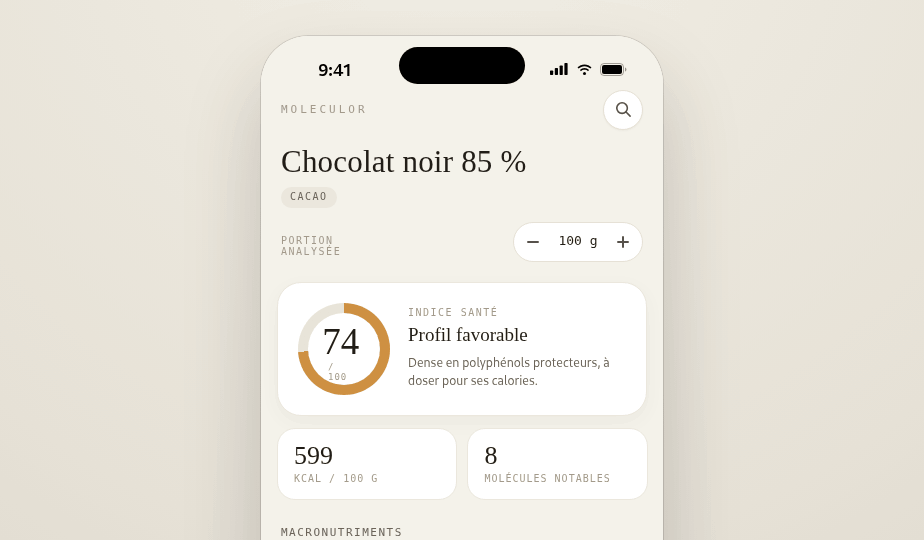
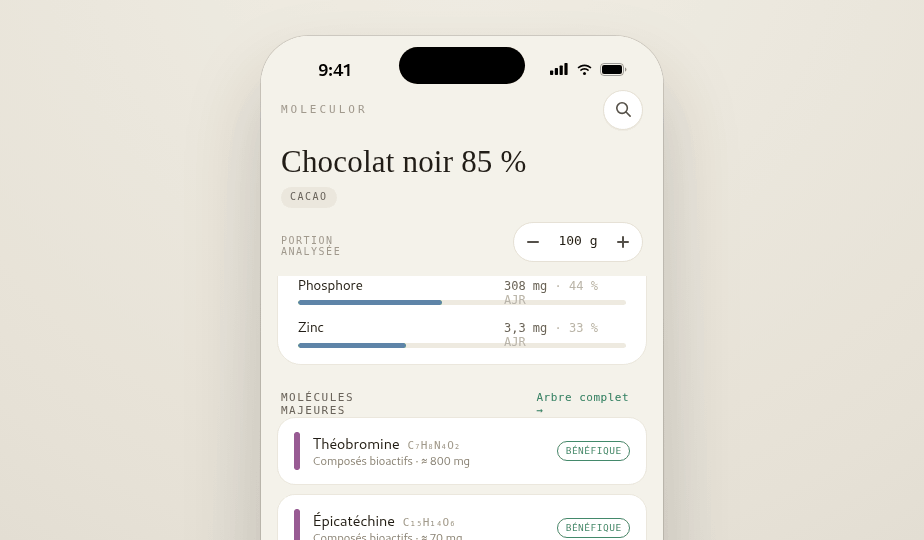
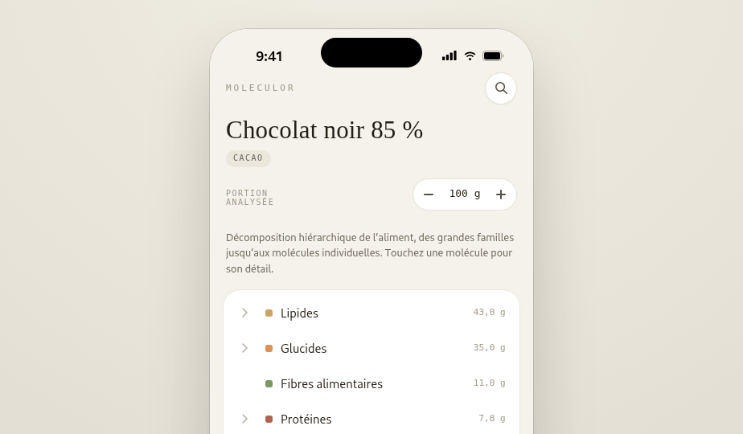
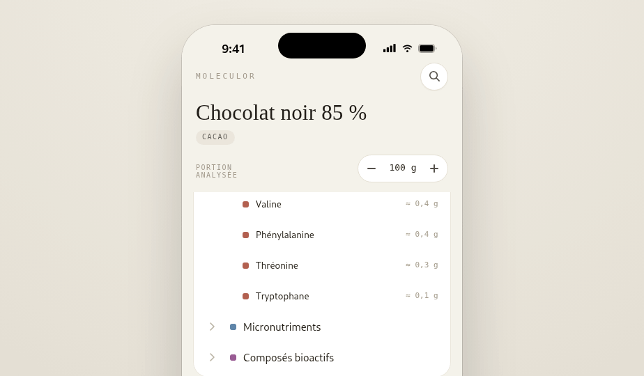
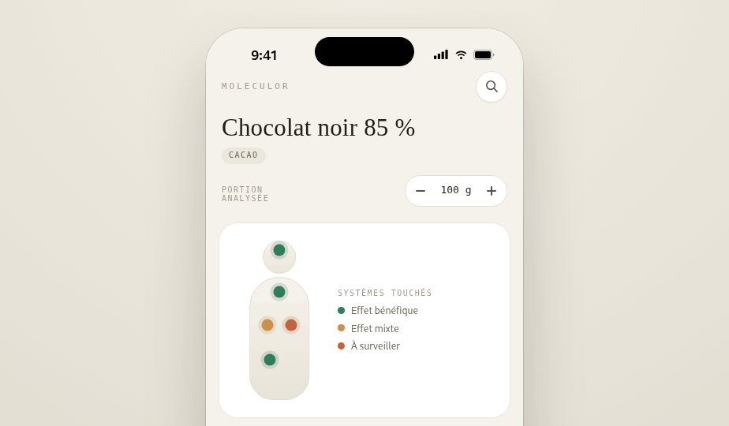
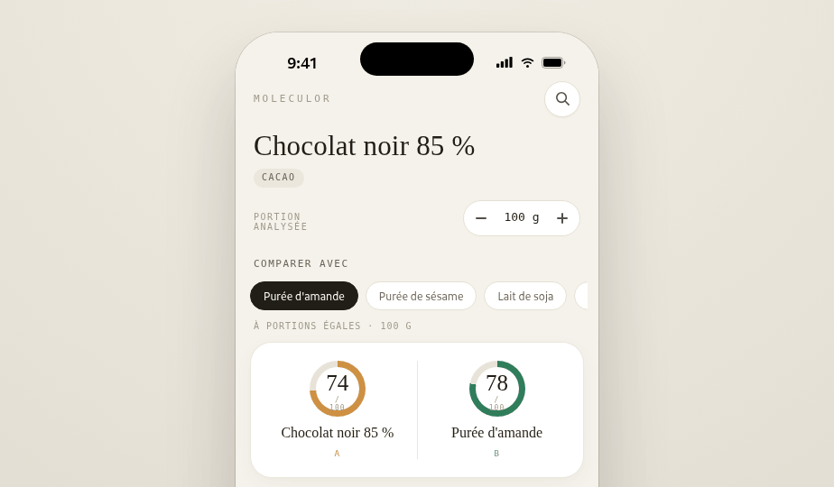
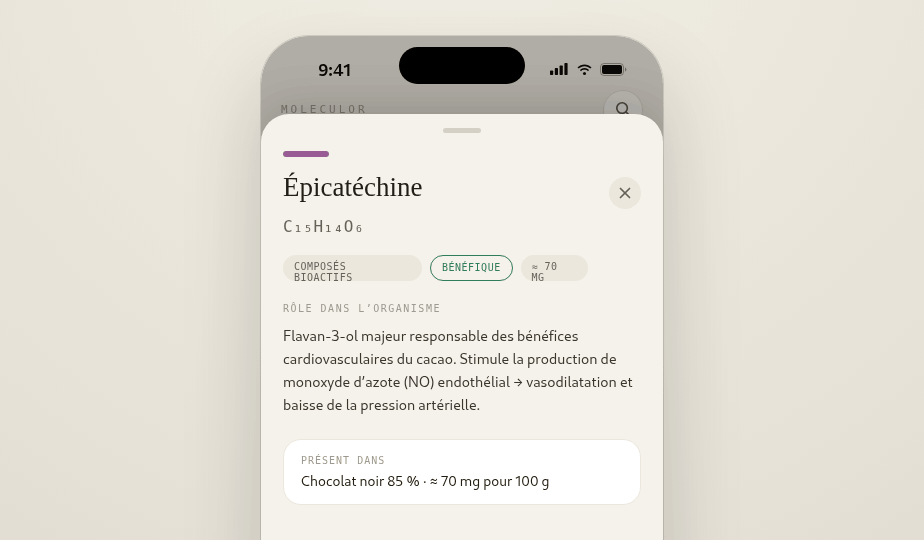

<div align="center">


# 🧬 Moleculor

### Explore la composition **moléculaire** des aliments — du nutriment à la molécule, jusqu'à son effet sur le corps.

[](https://react.dev)
[](https://vite.dev)
[](https://www.typescriptlang.org)
[](#-installer-en-pwa)
[](https://www.netlify.com)
[](https://openrouter.ai)

</div>

---

## 🍎 C'est quoi ?

**Moleculor** est une application mobile (PWA) qui décompose un aliment couche par couche :

> 🥄 **Aliment** → 🧱 **Familles** (lipides, glucides, fibres, protéines, micros, bioactifs) → ⚛️ **Molécules** → 🫀 **Effets sur le corps**

On choisit un aliment, on ajuste la **portion** (10–500 g), et toutes les valeurs et tous les statuts (bénéfique / à surveiller) se recalculent en direct. Et si un aliment manque dans la base, l'**IA le génère à la volée**. 🤖✨

## ✨ Fonctionnalités

| | Fonctionnalité | Détail |
|---|---|---|
| 🔬 | **Composition** | Anneaux de macros, micronutriments et molécules clés par aliment |
| 🌳 | **Arborescence** | Familles → sous-familles → molécules, dépliables (acides gras, acides aminés…) |
| 🫀 | **Corps** | Silhouette, systèmes touchés, bénéfices, interactions et points de vigilance |
| ⚖️ | **Comparer** | Deux aliments côte à côte, à portion égale ; **2ᵉ loupe** pour choisir l'aliment B dans toute la base (chips rapides + recherche) |
| 🎚️ | **Portion dynamique** | Stepper 10–500 g, recalcul live des valeurs et des valences |
| 🤖 | **Enrichissement IA** | Génère un aliment absent via **OpenRouter** (clé + modèle au choix) |
| ⏳ | **Génération en arrière-plan** | Badge flottant « IA » avec sablier animé + décompte en secondes, navigation jamais bloquée |
| 📱 | **PWA installable** | Icône d'app, plein écran, prête pour Netlify |

## 📸 Aperçu des écrans

### 🔬 Composition

<div align="center">

| Anneaux & macros | Micros & molécules |
|:---:|:---:|
|  |  |

</div>

### 🌳 Arborescence

<div align="center">

| Familles | Acides aminés dépliés |
|:---:|:---:|
|  |  |

</div>

### 🫀 Corps

<div align="center">

| Silhouette | Interactions | Bénéfices |
|:---:|:---:|:---:|
|  |  |  |

</div>

### ⚖️ Comparer · 🔍 Recherche · 🔎 Fiches détaillées

<div align="center">

| Comparer | Recherche | Fiche molécule | Fiche système |
|:---:|:---:|:---:|:---:|
|  |  |  |  |

</div>

## 🚀 Démarrage

```bash
cd app
npm install
npm run dev        # → http://localhost:5173
```

Autres scripts :

```bash
npm run build      # tsc -b + build de production (sortie : app/dist)
npm run preview    # sert le build de prod en local
npm run typecheck  # vérification de types seule
```

## 🤖 Enrichissement par l'IA (OpenRouter)

Quand un aliment n'existe pas encore, on peut le **générer** :

1. ⚙️ **Paramètres** (header) → saisir une **clé API OpenRouter** et choisir un **modèle** (« Charger les modèles » récupère le catalogue live).
2. 🔍 Dans la recherche, taper un aliment absent → **« Générer … avec l'IA »**.
3. ⏳ La génération tourne **en arrière-plan** : un badge flottant **« IA »** affiche un sablier qui tourne et un **décompte en secondes**, sans jamais bloquer la navigation. À la fin il devient cliquable (succès) ou affiche l'erreur.
4. 🧪 Le modèle renvoie un *spec* compact → **assaini** → passé à `makeFood`, qui dérive arbre, timeline, bénéfices et risques exactement comme les aliments intégrés.

Les aliments générés sont **persistés** dans `localStorage` sous forme de *specs* (pas l'objet `Food` dérivé), pour rester compatibles si le schéma évolue.

> ⚠️ **Sécurité** — la clé OpenRouter est stockée **en clair** côté client (`localStorage`). Acceptable pour une démo locale ; en production, la déplacer derrière un proxy backend pour qu'elle n'atteigne jamais le navigateur.

## 📱 Installer en PWA

L'app embarque un `manifest.webmanifest`, une icône maskable et les balises `apple-touch-icon`. Une fois déployée (HTTPS), « Ajouter à l'écran d'accueil » l'installe en plein écran avec l'icône molécule. 🧬

### Déployer sur Netlify

Le `netlify.toml` à la racine est déjà configuré (base `app/`, publish `app/dist`, fallback SPA) :

| Réglage | Valeur |
|---|---|
| Base directory | `app` |
| Build command | `npm run build` |
| Publish directory | `app/dist` |

→ Connecter le dépôt sur Netlify, ou `netlify deploy --prod`.

## 🗂️ Structure du dépôt

```
.
├── README.md                 # ce fichier
├── CONTEXT.md                # contexte produit + décisions d'architecture
├── CHANGELOG.md              # historique des versions
├── netlify.toml              # config de déploiement (PWA / SPA)
├── app/                      # l'application React + Vite
│   ├── public/               # icônes PWA + manifest
│   └── src/
│       ├── data/             # types, foodData (base + makeFood), repository, store, settings, enrich
│       ├── hooks/            # useFoodDB (base vivante : intégrée + générée)
│       ├── theme/            # tokens (couleurs, typo, rayons, ombres)
│       ├── components/       # Header, TabBar, Ring, Donut, GenerationBadge, icons
│       ├── screens/          # Composition, Tree, Body, Compare
│       └── overlays/         # Sheet, MoleculeSheet, SystemSheet, SearchOverlay, SettingsSheet
└── design_handoff_moleculor/ # spec de design d'origine + captures de référence
```

## 🧱 Stack

**React 18** · **Vite 5** · **TypeScript 5** · PWA · OpenRouter (génération IA) · zéro dépendance UI (SVG inline, design tokens maison).

## 🧭 En savoir plus

- 📖 [`CONTEXT.md`](CONTEXT.md) — modèle de données, pattern `makeFood`, et où brancher une vraie base nutritionnelle (Ciqual / ANSES / USDA).
- 📝 [`CHANGELOG.md`](CHANGELOG.md) — historique des versions.
- 🎨 [`app/README.md`](app/README.md) — notes techniques de l'app.

---

<div align="center">
<sub>Les valeurs nutritionnelles intégrées sont des ordres de grandeur de démonstration — voir <a href="CONTEXT.md">CONTEXT.md</a> pour brancher une source officielle.</sub>
</div>
